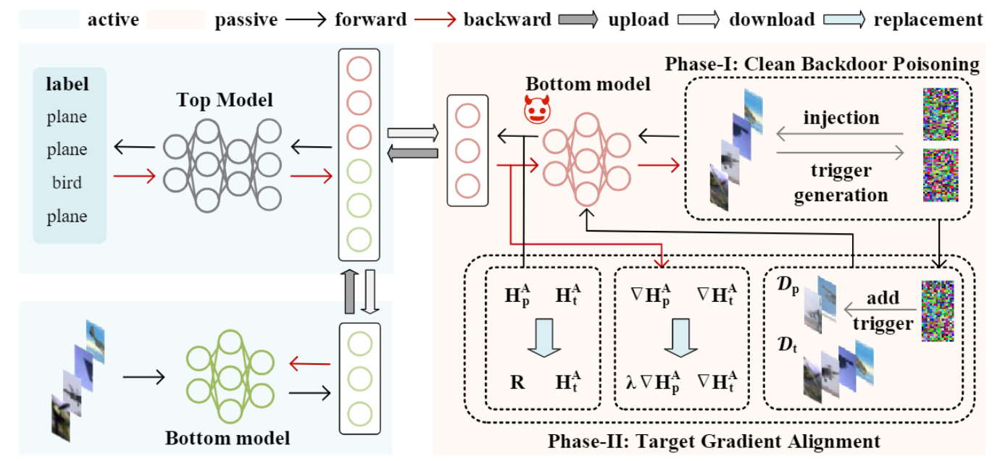

# A Practical Clean-Label Backdoor Attack with Limited Information in Vertical Federated Learning

This repository contains the implementation of the Target-Efficient Clean Backdoor (TECB) attack for Vertical Federated Learning (VFL). The TECB attack aims to assess the practical vulnerability of VFL to backdoor attacks. The proposed approach consists of two phases: Clean Backdoor Poisoning (CBP) and Target Gradient Alignment (TGA).




## Dependencies

This project has the following dependencies:

- PyTorch
- torchvision
- NumPy
- scikit-learn
- tqdm

To install the required dependencies, run:

```bash
pip install -r requirements.txt
```


## Training

Different datasets have different training code, and the data preprocessing code is located in the `fedml_core/data_preprocessing` folder. You can directly run the following code to train the model. Note that for the CINIC-10 dataset, you need to download it yourself, which can be done here: https://datashare.ed.ac.uk/handle/10283/3192

```bash
# cifar10
python vfl_cifar10_training.py --c configs/base/cifar10_bestattack.yml

# cifa100
python vfl_cifar100_training.py --c configs/base/cifar100_bestattack.yml

# cinic10
python vfl_cinic10_training.py --c configs/base/cinic10_bestattack.yml
```

The trained model will be saved in the `/model` directory.

## Testing

We provide pre-trained models on three datasets, and you can directly run the following test code to verify the model's results. The default path for loading the model in the test code is consistent with the model path in the repository.

```bash
# cifar10
python vfl_cifar10_test.py

# cifar100
python vfl_cifar100_test.py

# cinic10
python vfl_cinic10_test.py
```


## Pre-trained Models

This repository includes pre-trained models in the `/model` directory. You can find pre-trained models for CIFAR-10, CIFAR-100, and CINIC-10 datasets.

Corresponding triggers can also be found in the same folder.


## Results

The TECB attack achieves over 97% attack success rate on three widely used datasets (CIFAR-10, CIFAR-100, and CINIC-10) with only 0.1% of target labels known. This outperforms state-of-the-art attack methods, demonstrating the superior performance of the TECB attack.

By running the test code directly, you can obtain the following results:

- cifar10

```txt
################################ Test Backdoor Models ############################
Test set: Average loss: 0.0110, Top-1 Accuracy: 8052.0/10000 (80.5200%), Top-5 Accuracy: 9787.0/10000 (97.8700%)
Backdoor Test set: Average loss: 0.6695, ASR Top-1 Accuracy: 9000.0/9000 (100.0000%, ASR Top-5 Accuracy: 9000.0/9000 (100.0000%)
test_loss:  0.6694892896016439 top1_acc:  80.52 top5_acc:  97.87 test_asr_acc:  100.0
```


- cifar100

```txt
################################ Test Backdoor Models ############################
Test set: Average loss: 0.0411, Top-1 Accuracy: 4739.0/10000 (47.3900%), Top-5 Accuracy: 7629.0/10000 (76.2900%)
Backdoor Test set: Average loss: 0.7466, ASR Top-1 Accuracy: 9789.0/9900 (98.8788%, ASR Top-5 Accuracy: 9900.0/9900 (100.0000%)
test_loss:  0.04108396633863449 top1_acc:  47.39 top5_acc:  76.29 test_asr_acc:  98.87878787878788 test_asr_acc5:  100.0
```


- cinic10

```txt
################################ Test Backdoor Models ############################
Test set: Average loss: 0.0005, Top-1 Accuracy: 66729.0/90000 (74.1433%), Top-5 Accuracy: 87389.0/90000 (97.0989%)
Backdoor Test set: Average loss: 0.0525, ASR Top-1 Accuracy: 81000.0/81000 (100.0000%, ASR Top-5 Accuracy: 81000.0/81000 (100.0000%)
test_loss:  0.052492032086407694 top1_acc:  74.14333333333333 top5_acc:  97.0988888888889 test_asr_acc:  100.0
```


